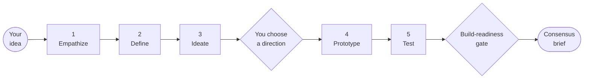
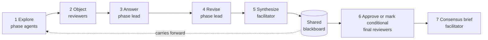
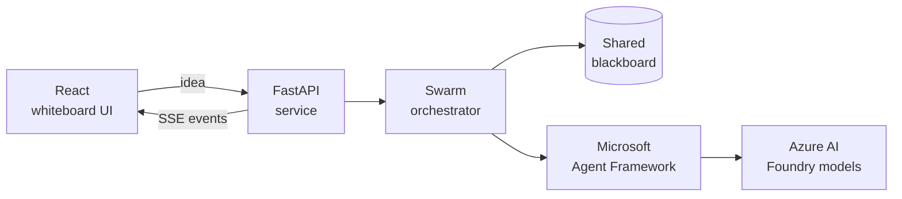

# Design Thinking Council

> **Run a real design-thinking workshop with a swarm of AI agents.** Bring a rough idea into the workshop room, watch ten role-based agents explore it, challenge it, and converge on a scoped direction you can hand straight to a coding agent.

[](https://react.dev)
[](https://www.typescriptlang.org)
[](https://fastapi.tiangolo.com)
[](https://learn.microsoft.com/agent-framework/)
[](LICENSE)

Most AI ideation tools give you one voice that agrees with you. This one gives you a workshop room: ten role-based agents who explore in parallel, disagree on the record, and are held to a shared blackboard that separates what is known from what is merely assumed. You leave with a whiteboard, a reasoning trail, and a consensus brief a coding agent can act on.

## See it in action

The session is presented as a workshop room, not a chat log. The agent constellation updates live as the swarm moves through each round:


The whiteboard preserves the sticky notes, phase lanes, and discussion trail as they happen:


The final consensus brief turns that trail into a focused handoff:


## Contents

1. [Who is in the room](#who-is-in-the-room)
2. [The five phases](#the-five-phases)
3. [How the swarm works](#how-the-swarm-works)
4. [Quick walkthrough](#quick-walkthrough)
5. [What you leave with](#what-you-leave-with)
6. [Worked example](#worked-example)
7. [Interface principles](#interface-principles)
8. [Setup](#setup)
9. [Reference](#reference)
10. [How this project was made](#how-this-project-was-made)
11. [License](#license)

## Who is in the room

Ten agents with fixed roles and distinct mandates: a facilitator who keeps the session decision-ready, five phase leads who own a stage of the flow, and four reviewers who prioritize pushback while also contributing in selected phases.

### Facilitator and phase leads

| Agent | Focus | Leads | What it produces |
|---|---|---|---|
| 🧭 **Facilitator** | Keeps the process iterative and decision-ready | The whole session | Phase synthesis, decisions, consensus brief |
| ❤️ **User researcher** | Context, behavior, needs, pain points | Empathize | Observed behavior, workarounds, emotions |
| 🧩 **Problem framer** | Insights and problem statements | Define | Problem framing, design criteria, How Might We questions |
| ✨ **Ideation lead** | Divergent concepts and opportunity areas | Ideate | Three to four deliberately different directions |
| 🧱 **Prototype designer** | Tangible concepts, journeys, MVP shape | Prototype | Journeys, rough flows, MVP scope, clickable concepts |
| 📈 **Validation lead** | Tests, assumptions, iteration plan | Test | Assumptions, user tests, success metrics |

### Reviewers

These agents never own a phase. Their job is to find the weak claim before you build on it.

| Agent | Focus | Reviews | Typical objection |
|---|---|---|---|
| 📊 **Business viability** | Adoption, differentiation, strategic fit | Define, Ideate, Test | "Willingness to pay is still hypothetical" |
| 💻 **Technical feasibility** | Architecture, dependencies, build risk | Ideate, Prototype | "This integration should be deferred from the MVP" |
| 🎯 **Design critic** | Clarity, friction, tradeoffs, edge cases | Empathize, Define, Prototype | "The value is unclear and this consensus is fake" |
| 🛡️ **Ethics and trust** | Consent, safety, privacy, user control | Empathize, Ideate, Test | "This shifts risk onto the user without informed consent" |

## The five phases

The canonical Design Thinking flow, with a named lead, parallel contributors, and assigned reviewers at every phase.

| # | Phase | Objective | Lead | Contributors | Reviewers |
|---|---|---|---|---|---|
| 1 | **Empathize** | Understand users, context, behaviors, workarounds, and needs | ❤️ User researcher | 🛡️ Ethics and trust | 🎯 Design critic, 🛡️ Ethics and trust |
| 2 | **Define** | Synthesize research into insights and How Might We questions | 🧩 Problem framer | 🎯 Design critic | 🎯 Design critic, 📊 Business viability |
| 3 | **Ideate** | Generate many directions before judging or converging | ✨ Ideation lead | 📊 Business viability, 💻 Technical feasibility | 📊 Business, 💻 Technical, 🛡️ Ethics |
| 4 | **Prototype** | Make the strongest idea tangible | 🧱 Prototype designer | 💻 Technical feasibility, 🎯 Design critic | 💻 Technical feasibility, 🎯 Design critic |
| 5 | **Test** | Evaluate, capture feedback, and decide how to iterate | 📈 Validation lead | 📊 Business, 🛡️ Ethics, 🧭 Facilitator | 📊 Business viability, 🛡️ Ethics and trust |

> **You step into the room once.** After Ideate, the session pauses so you can choose the direction that advances into Prototype. If you do not choose, the swarm carries the first viable concept forward.



## How the swarm works

This is a **bounded, facilitated swarm**, not a collection of disconnected chatbots and not an open-ended agent free-for-all. Roles are fixed, rounds are structured, and each phase repeats steps 1 through 5 before the session finishes with steps 6 and 7 once.



Three details make the loop more than a prompt chain. Agents in step 1 run concurrently and do not see each other's answers first, so divergence is real rather than an echo. Reviewers in step 2 are instructed to object rather than agree, and every objection they raise must be answered in step 3 with a decision *and* a concrete action. Step 6 records blockers and can mark the final handoff as conditional, rather than silently declaring the direction ready.

### The shared blackboard

The blackboard keeps each phase from starting over, and keeps the swarm honest about what it actually knows.

| Slot | Holds | Trust level |
|---|---|---|
| **Evidence** | Facts you supplied or the swarm explicitly observed | Treated as true |
| **Assumptions** | Claims that may be true but still require testing | Must be validated |
| **Concepts** | Divergent directions explored during Ideate | Candidate only |
| **Objections** | Unresolved risks and reviewer challenges | Open |
| **Decisions** | Choices made by the swarm or by you | Committed |
| **Selected concept** | The direction carried into Prototype | Committed |

### Under the hood

- Streams typed contributions, critiques, debates, revisions, syntheses, approvals, and blackboard updates to the UI over SSE
- Preserves run state for stream replay and reconnects while the backend process remains available
- Runs on mock agents for demonstrations, or on real Microsoft Agent Framework and Azure AI Foundry calls

## Quick walkthrough

1. Enter a product idea, service concept, or customer problem.
2. Start the workshop and watch the agents explore the Empathize phase.
3. Follow the phase tracker as the swarm moves through Define, Ideate, Prototype, and Test.
4. During Ideate, choose the direction that should move into Prototype.
5. Review the whiteboard, transcript, blackboard, and consensus brief.
6. Copy the brief straight into a coding agent, or export the session.

## What you leave with

| Artifact | Use it for | Export as |
|---|---|---|
| **Whiteboard** | The whole session at a glance, phase by phase | Board JSON |
| **Transcript** | Auditing every contribution, critique, debate, and approval | Markdown |
| **Shared blackboard** | The reasoning trail behind each decision | Session JSON |
| **Consensus brief** | Handing the direction to a coding agent or a team | Markdown, PDF, clipboard |

The consensus brief contains target users, observed evidence, the problem hypothesis, the refined concept, a How Might We statement, the MVP boundary and explicit exclusions, assumptions to validate, a prototype recommendation, safety and adoption and validation test plans, an implementation handoff for coding agents, and an applied build-readiness status with blockers and required follow-up.

> **The brief is deliberately honest about uncertainty.** The swarm must not call a problem validated when the session has only generated hypotheses. Facts you supply are evidence. Agent inferences are hypotheses until tested.

## Worked example

For the idea:

> A meal-planning app for parents managing children's food allergies.

the swarm may explore meal planning, caregiver handoffs, and safety workflows, challenge assumptions about freshness and comprehension, select a versioned handoff concept, and recommend a clickable prototype that tests expired, changed, conflicting, and unavailable information scenarios.

The result is not a claim that the market or medical workflow has been validated. It is a scoped product direction and a concrete plan for learning what to build next.

## Interface principles

Every panel in the workshop room answers exactly one question, so the session stays readable while ten agents work.

| Panel | Answers |
|---|---|
| **Agent constellation** | Who is participating, and what each role is doing right now |
| **Phase tracker** | Where the session is in the Design Thinking sequence |
| **Current-phase summary** | What the group is trying to accomplish |
| **Whiteboard** | What the group has produced |
| **Transcript** | Why, in full chronological detail |

Concept selection appears only during Ideate. Once the workshop is complete, the current phase becomes **Complete** and the consensus brief takes over as the primary handoff.

## Setup

### Repository layout

```text
.
├── backend/              # FastAPI + Microsoft Agent Framework service
├── public/               # Static frontend assets
├── src/                  # React UI
├── Dockerfile            # Multi-stage frontend + API image
└── .env.example          # Public-safe configuration template
```

### Tech stack

| Layer | Built with |
|---|---|
| **Frontend** | React 19, TypeScript, Vite, CSS |
| **Backend** | Python, FastAPI, Pydantic, Uvicorn |
| **Agent orchestration** | Microsoft Agent Framework with Azure Identity |
| **Streaming** | Server-sent events for live workshop updates |
| **Validation** | TypeScript build checks, oxlint, Python `unittest` |



### Local backend with Microsoft Agent Framework

Install Node.js 22.12 or later in the Node 22 release line and npm 10.9. The
repository's `.nvmrc` selects the tested Node version for compatible version managers.

1. Configure Azure authentication, for example `az login`.
2. Create a Python environment and install the backend dependencies:

```powershell
python -m venv .venv
.\.venv\Scripts\Activate.ps1
pip install -r backend\requirements.txt
```

3. Copy `.env.example` to `.env` and set:

```text
MOCK_AGENTS=false
FOUNDRY_PROJECT_ENDPOINT=https://<your-foundry-project>.services.ai.azure.com
FOUNDRY_MODEL_DEPLOYMENT_NAME=<your-model-deployment-name>
```

4. Start the backend:

```powershell
python -m uvicorn backend.app:app --reload --host 127.0.0.1 --port 8000
```

5. In another terminal, install the frontend dependencies and start the workshop room:

```powershell
npm ci --include=optional
$env:VITE_USE_BACKEND = "true"
npm run dev
```

The backend creates Microsoft Agent Framework agents for each workshop role and streams structured events to the UI.

#### Hybrid model routing

The backend can route different agent responsibilities to different Foundry deployments:

```text
FOUNDRY_WORKER_MODEL_DEPLOYMENT_NAME=<fast-model-for-stage-agents>
FOUNDRY_REVIEWER_MODEL_DEPLOYMENT_NAME=<strong-model-for-reviewers>
FOUNDRY_FACILITATOR_MODEL_DEPLOYMENT_NAME=<strong-model-for-phase-synthesis>
FOUNDRY_FINAL_MODEL_DEPLOYMENT_NAME=<best-model-for-final-brief>
```

If these are omitted, the app falls back to `FOUNDRY_MODEL_DEPLOYMENT_NAME` for every agent.

### Validation

Run the project's frontend and backend checks before submitting changes:

```powershell
npm run build
npm run lint
python -m unittest backend.test_app
python -m py_compile backend\app.py
```

These are the same checks enforced by continuous integration on Windows and Ubuntu.

## Reference

### Local API endpoints

| Endpoint | Purpose |
|---|---|
| `GET /api/health` | Health, mock mode, model routing, orchestration pattern |
| `GET /api/workshops/stream?idea=...` | Server-sent event stream for a workshop run |
| `POST /api/workshops` | Create a run ID before opening the stream |
| `GET /api/agents` | List agent metadata and phase definitions used by the UI |
| `GET /api/workshop-runs/{runId}` | Inspect saved run state and event history |
| `POST /api/workshop-runs/{runId}/selected-concept` | Save the user-selected Ideate concept before Prototype |
| `POST /api/workshop-runs/{runId}/cancel` | Cancel an active run |

## How this project was made

This project was created with substantial assistance from AI coding and design agents. The implementation, prompts, interface, documentation, and example outputs were iterated with human direction and review. AI-generated output should be treated as a starting point: review the code, dependencies, security configuration, and workshop conclusions before relying on them.

## License

This project is licensed under the [MIT License](LICENSE).
