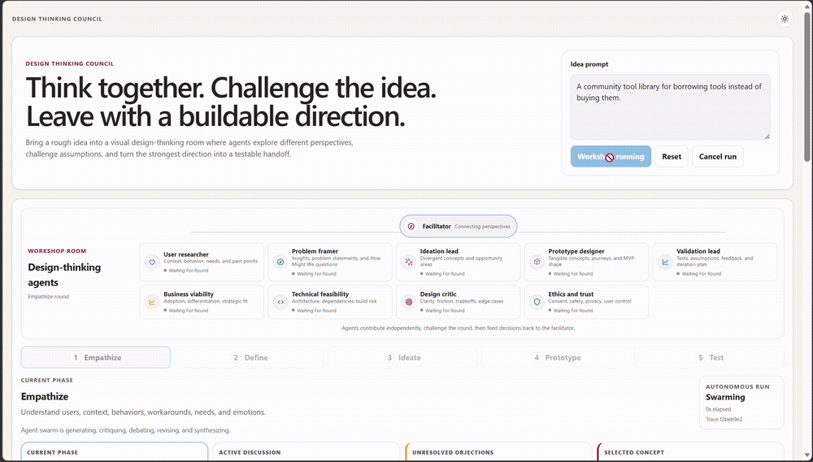
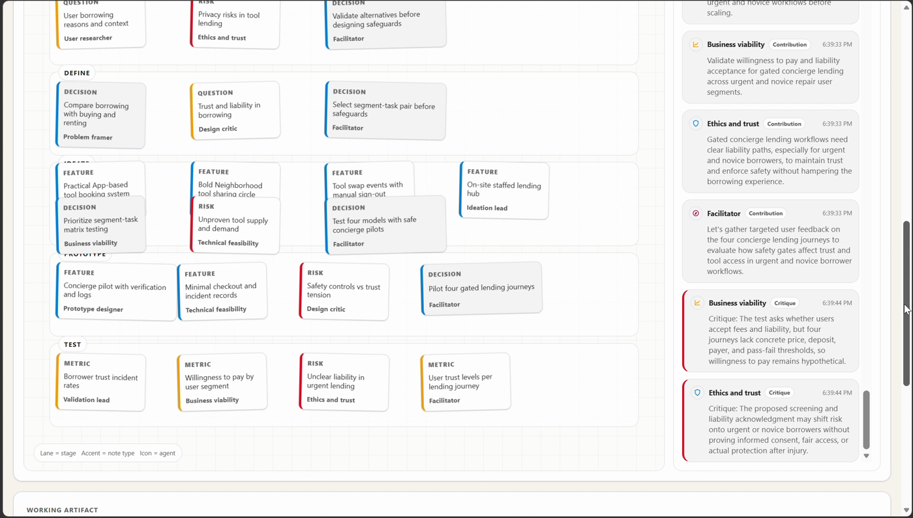
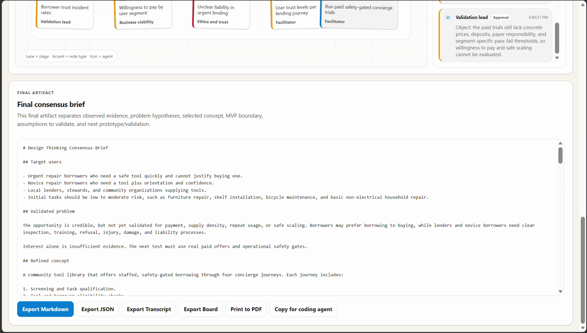

# Design Thinking Council

Design Thinking Council is a visual, facilitated AI workshop that turns a rough product idea into a focused, testable direction and coding-agent-ready handoff. Role-based agents contribute different perspectives, challenge assumptions, converge on decisions, and leave behind a collaborative whiteboard, reasoning trail, and consensus brief.

The interface is a collaborative whiteboard with phase lanes, sticky notes, agent discussion, a shared blackboard, live synthesis, and an exportable consensus brief.

## See it in action

The workshop is presented as a visual room: the facilitator coordinates the session while role-based agents contribute, challenge, and revise the work. During a live run, the agent cards update as the swarm moves through each round:



The finished board preserves the notes, stages, and discussion trail:



The final consensus brief turns that trail into a focused handoff:



## Contents

1. [What it does](#what-it-does)
2. [Quick walkthrough](#quick-walkthrough)
3. [Session architecture](#session-architecture)
4. [Outputs](#outputs)
5. [Example](#example)
6. [Interface principles](#interface-principles)
7. [Setup](#setup)
8. [Reference](#reference)
9. [How this project was made](#how-this-project-was-made)
10. [License](#license)

## What it does

This is a **bounded, facilitated swarm**, not a collection of disconnected chatbots. A stable set of role-based agents works independently where divergence is useful, then shares work, challenges concrete objections, revises outputs, and converges through the five-stage Design Thinking flow.

- Runs the standard Design Thinking flow: **Empathize, Define, Ideate, Prototype, Test**
- Uses role-based agents including user research, problem framing, ideation, prototyping, validation, facilitation, business viability, technical feasibility, design critique, and ethics/trust
- Runs phase agents concurrently, then performs reviewer critique, claim-level debate, lead revision, and facilitator synthesis
- Maintains a shared blackboard of evidence, assumptions, concepts, objections, decisions, and the selected concept
- Produces multiple deliberately different Ideate directions, including practical, bold, and low-tech options
- Lets the user choose the concept that advances into Prototype
- Distinguishes observed evidence from working hypotheses and assumptions that still need validation
- Runs a final approval/objector loop before producing the consensus brief
- Streams typed contributions, critiques, debates, revisions, syntheses, approvals, and blackboard updates to the UI
- Preserves run state for SSE replay and reconnects while the backend process remains available
- Supports mock demonstrations or real Microsoft Agent Framework + Azure Foundry calls

## Quick walkthrough

1. Enter a product idea, service concept, or customer problem.
2. Start the workshop and watch the agents explore the Empathize stage.
3. Follow the phase tracker as the swarm moves through Define, Ideate, Prototype, and Test.
4. During Ideate, choose the direction that should move into Prototype.
5. Review the board, transcript, blackboard, and final consensus brief.
6. Copy the brief for a coding agent or export it as Markdown, JSON, transcript, board, or PDF.

## Session architecture

Each stage follows this bounded collaboration loop:

```text
1. Role-based agents independently explore the stage
2. Reviewers identify concrete objections and missing perspectives
3. The phase lead accepts, qualifies, or rejects each objection
4. The phase lead revises the stage output
5. The facilitator synthesizes decisions into the shared blackboard
6. Final reviewers approve the handoff or identify blockers
7. The facilitator writes the final consensus brief
```

The shared blackboard prevents each phase from starting over. It carries forward:

- **Evidence**: facts supplied by the user or explicitly observed
- **Assumptions**: claims that may be true but still require testing
- **Concepts**: divergent directions explored during Ideate
- **Objections**: unresolved risks and reviewer challenges
- **Decisions**: choices made by the swarm or the user
- **Selected concept**: the direction carried into Prototype

The phase tracker shows where the session is. The agent constellation shows who is contributing and whether each role is waiting, contributing, challenging, revising, synthesizing, or approved. The whiteboard shows the work product, while the transcript preserves the detailed reasoning trail.

## Outputs

A completed session produces:

- A whiteboard of phase stickies
- A transcript showing contributions, critiques, debates, revisions, and approvals
- A shared blackboard containing the reasoning trail
- A selected concept and the decision that carried it into Prototype
- A final consensus brief with:
  - target users
  - observed evidence
  - problem hypothesis
  - refined concept
  - How Might We statement
  - MVP boundary and exclusions
  - assumptions to validate
  - prototype recommendation
  - safety, adoption, and validation test plans
  - implementation handoff for coding agents
  - applied build-readiness status, blockers, and required follow-up

The brief is deliberately honest about uncertainty. The swarm must not call a problem validated when the session has only generated hypotheses. For example, user-provided facts are evidence; agent inferences are hypotheses until tested.

## Example

For the idea:

> A meal-planning app for parents managing children's food allergies.

the swarm may explore meal planning, caregiver handoffs, and safety workflows, challenge assumptions about freshness and comprehension, select a versioned handoff concept, and recommend a clickable prototype that tests expired, changed, conflicting, and unavailable information scenarios.

The result is not a claim that the market or medical workflow has been validated. It is a scoped product direction and a concrete plan for learning what to build next.

## Interface principles

The primary view shows the workshop as a room, not just a log:

- The **agent constellation** answers who is participating and what each role is doing now.
- The **phase tracker** answers where the session is in the Design Thinking sequence.
- The **current-phase summary** answers what the group is trying to accomplish.
- The **whiteboard** answers what the group has produced.
- The **transcript** remains available for the detailed chronological reasoning trail.

Concept selection appears only during Ideate, when the user can choose which direction should move into Prototype. Once the workshop is complete, the current phase becomes **Complete** and the final brief becomes the primary handoff.

## Setup

### Repository layout

```text
.
├── backend/              # FastAPI + Microsoft Agent Framework service
├── public/               # Static frontend assets
├── src/                  # React UI
├── Dockerfile            # Multi-stage frontend + API image
└── .env.example          # Public-safe configuration template
```

### Tech stack

- **Frontend:** React 19, TypeScript, Vite, and CSS
- **Backend:** Python, FastAPI, Pydantic, and Uvicorn
- **Agent orchestration:** Microsoft Agent Framework with Azure Identity
- **Streaming:** Server-sent events (SSE) for live workshop updates
- **Validation and tooling:** TypeScript build checks, oxlint, and Python `unittest`

### Local frontend only

Install Node.js 22.12 or later in the Node 22 release line and npm 10.9. The
repository's `.nvmrc` selects the tested Node version for compatible version managers.

```powershell
npm ci --include=optional
npm run dev
```

This uses the built-in local demo events unless `VITE_USE_BACKEND=true` is set.

### Quality gates

```powershell
npm run build
npm run lint
python -m unittest backend.test_app
python -m py_compile backend\app.py
```

These are the same checks enforced by continuous integration on Windows and Ubuntu.

### Local backend with mock agents

```powershell
python -m venv .venv
.\.venv\Scripts\Activate.ps1
pip install -r backend\requirements.txt
Copy-Item .env.example .env
python -m uvicorn backend.app:app --reload --host 127.0.0.1 --port 8000
```

In another terminal:

```powershell
$env:VITE_USE_BACKEND = "true"
npm run dev
```

### Local backend with Microsoft Agent Framework

1. Configure Azure authentication, for example `az login`.
2. Copy `.env.example` to `.env`.
3. Set:

```text
MOCK_AGENTS=false
FOUNDRY_PROJECT_ENDPOINT=https://<your-foundry-project>.services.ai.azure.com
FOUNDRY_MODEL_DEPLOYMENT_NAME=<your-model-deployment-name>
```

Then run the backend and frontend as above. The backend creates Microsoft Agent Framework agents for each workshop role and streams structured events to the UI.

#### Hybrid model routing

The backend can route different agent responsibilities to different Foundry deployments:

```text
FOUNDRY_WORKER_MODEL_DEPLOYMENT_NAME=<fast-model-for-stage-agents>
FOUNDRY_REVIEWER_MODEL_DEPLOYMENT_NAME=<strong-model-for-reviewers>
FOUNDRY_FACILITATOR_MODEL_DEPLOYMENT_NAME=<strong-model-for-phase-synthesis>
FOUNDRY_FINAL_MODEL_DEPLOYMENT_NAME=<best-model-for-final-brief>
```

If these are omitted, the app falls back to `FOUNDRY_MODEL_DEPLOYMENT_NAME` for every agent.

## Reference

### Local API endpoints

| Endpoint | Purpose |
|---|---|
| `GET /api/health` | Health, mock mode, model routing, orchestration pattern |
| `GET /api/workshops/stream?idea=...` | Server-sent event stream for a workshop run |
| `POST /api/workshops` | Create a run ID before opening the stream |
| `GET /api/workshop-runs/{runId}` | Inspect saved run state and event history |
| `POST /api/workshop-runs/{runId}/cancel` | Cancel an active run |

## How this project was made

This project was created with substantial assistance from AI coding and design agents. The implementation, prompts, interface, documentation, and example outputs were iterated with human direction and review. AI-generated output should be treated as a starting point: review the code, dependencies, security configuration, and workshop conclusions before relying on them.

## License

This project is licensed under the [MIT License](LICENSE).
